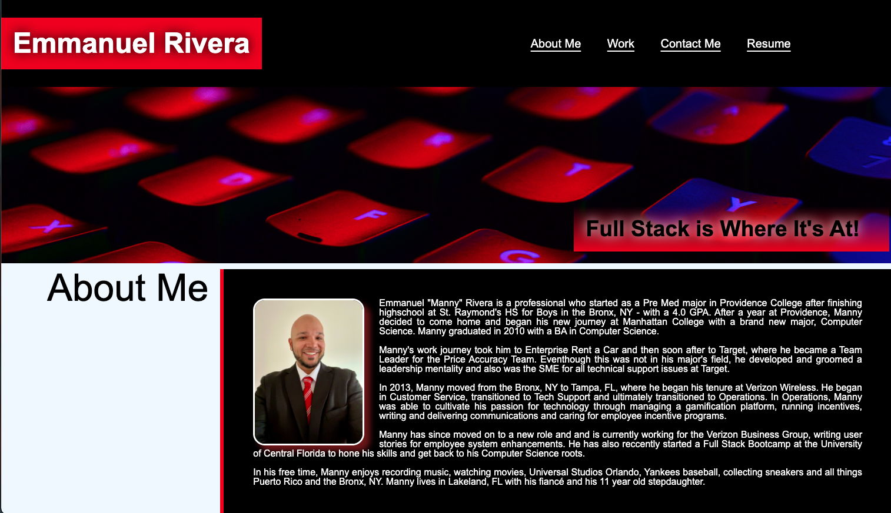

# challenge_11-17
Second homework assignment due 11_17

## Description

My personal and professional portfolio with work examples and resume.

## Screenshot

## Link to Deployed Application

Github Pages: https://yankeeknight.github.io/challenge_11-17/

## Sources
1. Rivera, Emmanuel. backtopstart.png

2. Rivera, Emmanuel. LOGOBLK.png

3. “myHeroAlt.png” Pexels.com, https://www.pexels.com/photo/close-up-of-computer-keyboard-249203/

4. "resume-hero.jpg" Pexels.com, https://www.pexels.com/photo/black-typewriter-machine-typing-on-white-printer-paper-1303835/ 

5. "workImage-1.jpg" Pexels.com, https://www.pexels.com/photo/contemporary-computer-monitors-on-wooden-desk-4792733/

6. "workImage-2.jpg" Pexels.com, https://www.pexels.com/photo/close-up-photo-of-codes-1089440/ 

7. "workImage-3.jpg" Pexels.com, https://www.pexels.com/photo/glow-in-the-dark-keyboard-14011035/

8. "workImage-4.jpg" Pexels.com, https://www.pexels.com/photo/black-flat-screen-computer-monitor-4584830/ 

9. "workImage-5.jpg" Pexels.com, https://www.pexels.com/photo/close-up-of-computer-keyboard-248515/

## Usage

Portfolio for a potential employer to view.

## License

Please refer to the LICENSE in the repo.

---